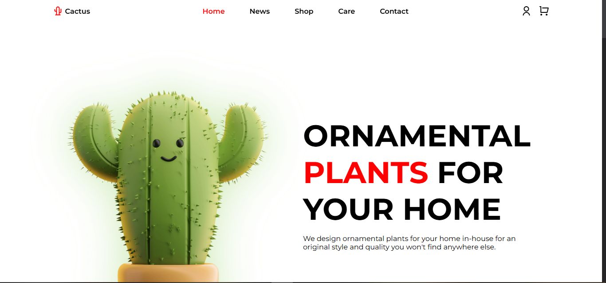

# Cactus Showcasing Website

This project is a static website designed to showcase various types of cactus. Created using HTML and CSS, the site provides a visually appealing way for users to browse through cactus species, learn about their unique features, and appreciate their aesthetic value.

## Features

- **Homepage** with featured cacti and an introduction to different types.
- **Responsive Design** for a seamless experience across different devices and screen sizes.

## Technologies Used

- **HTML** - For structuring the content and layout of the website.
- **CSS** - For styling, including layout design, colors, and responsive adjustments.

